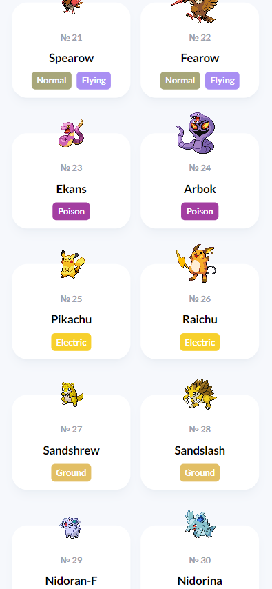

# Pokedex
Welcome to the Pokedex project! This application is built using React and the PokeAPI, styled with Tailwind CSS, and designed with a strong emphasis on responsiveness across various devices.

## Demo
You can view a live demo of the project [here](https://ixedasan.github.io/pokedex/)

## Preview
### Mobile




### Desktop


## Installation
To clone and run this application, you'll need [Git](https://git-scm.com/) and [NPM](https://nodejs.org/en/download/package-manager) installed on your computer. From your command line:

```
# Clone this repository
$ git clone https://github.com/ixedasan/pokedex

# Navigate to the project directory
$ cd pokedex

# Install dependencies
$ npm install

# start the server
$ npm run dev
```

## Contributing
Contributions are welcome! Please feel free to submit a Pull Request.

## Acknowledgements
[PokeAPI](https://pokeapi.co/) for providing the Pokémon data.
